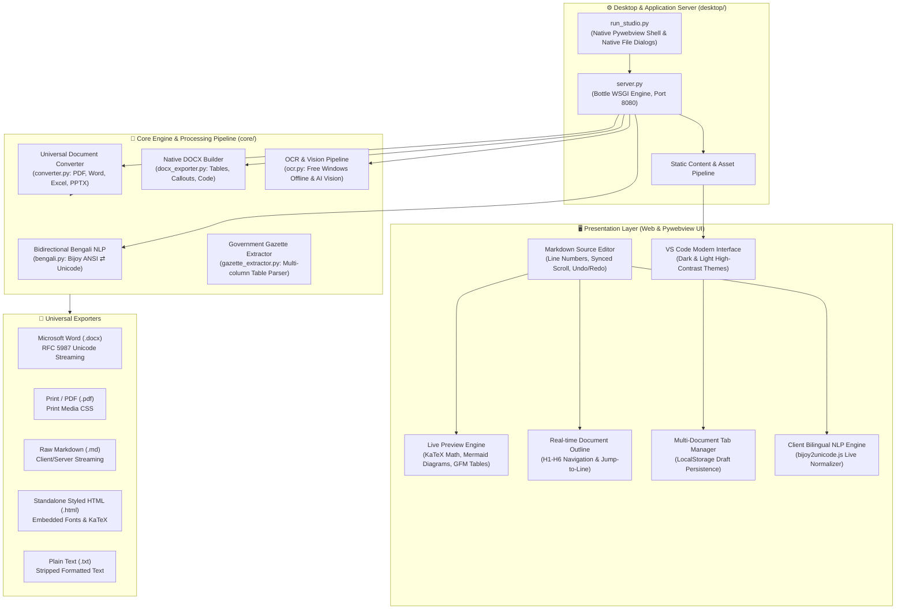

# MarkItDown Studio

<div align="center">

# 🚀 MarkItDown Studio
### Universal Markdown Workspace, Document Conversion Engine & Bilingual NLP Suite

[](https://www.python.org/)
[](https://github.com/syedarifulislamemon2010/markitdown)
[](LICENSE)
[](https://github.com/syedarifulislamemon2010)
[](#)

</div>

---

## 📌 Overview

**MarkItDown Studio** is a modern, high-performance desktop and web markdown workspace and universal document conversion engine developed by **Syed Ariful Islam Emon**.

It integrates multi-format document ingestion (**PDF, DOCX, XLSX, PPTX, Images, Audio, Scans**) with a real-time side-by-side Markdown IDE, bidirectional Bengali/English typography engines (**Bijoy / ANSI ⇄ Unicode**), **LaTeX / KaTeX** mathematical rendering, **Mermaid.js** diagrams, dynamic document outline navigation, and automated multi-format export (**Microsoft Word .docx, PDF, Markdown, HTML, Plain Text**).

The application functions completely **100% offline** without requiring external cloud services, while also providing optional high-accuracy AI Vision integration for complex government gazettes and degraded image scans.

---

## 🏗️ System Architecture

The following diagram illustrates the end-to-end architecture of **MarkItDown Studio**:



---

## 🧩 Architectural Components

### 1. Presentation & IDE Layer (`web/`)
- **VS Code Inspired Dual-Pane Layout**: Side-by-side editing and live preview with draggable split-pane resizer.
- **High-Contrast Theme System**: Seamless toggling between **VS Code Dark Modern** (`#1e1e1e`) and **Light Modern** (`#ffffff`) with strictly contrast-calibrated typography and CSS variable design tokens.
- **Native Document Outline**: Scans Markdown headers (`#` to `######`) in real time, generates an interactive hierarchical outline in the sidebar, and allows smooth jump-to-line navigation.
- **Multi-Document Workspace**: Support for multiple open tabs (`Ctrl+N`, `Ctrl+W`) with persistent state preservation in browser `localStorage`—preventing data loss during reloads or system restarts.
- **Rich Media & Math Extensions**:
  - **LaTeX / KaTeX**: Real-time rendering of inline (`$...$`) and display (`$$...$$`) mathematical formulas.
  - **Mermaid.js**: Client-side execution and vector SVG rendering of flowcharts, state machines, and sequence diagrams.
  - **Single-Toast Manager**: Lightweight, non-blocking notification queue delivering instant visual feedback without alert dialogs.

### 2. Desktop Shell & Local WSGI Server (`desktop/`)
- **Pywebview Desktop Runtime (`desktop/run_studio.py`)**: Provides a native Windows desktop experience powered by Microsoft Edge WebView2, supporting native OS `SaveFileDialog` and hardware-accelerated rendering.
- **WSGI REST Server (`desktop/server.py`)**: Built on an ultra-lightweight Bottle micro-framework running on `127.0.0.1:8080`.
- **RFC 5987 / RFC 6266 Compliant Streaming**: Ensures non-ASCII filenames (such as Bengali document titles) download smoothly across all browsers without triggering Python WSGI `UnicodeEncodeError`.

### 3. Core Universal Document Converter (`core/converter.py`)
- Ingests diverse file formats and extracts clean, structured CommonMark markdown:
  - **PDF (`.pdf`)**: Layout-aware text, table, and heading extraction.
  - **Microsoft Word (`.docx`)**: XML DOM traversal mapping paragraphs, styles, headings, and tables.
  - **Microsoft Excel (`.xlsx`, `.xls`, `.csv`)**: Sheet-to-markdown table conversion.
  - **PowerPoint (`.pptx`)**: Slide-by-slide hierarchy extraction with speaker notes.
  - **HTML / Web Pages**: HTML semantic node cleanup into pure Markdown.
  - **Audio & Media (`.mp3`, `.wav`)**: Offline/AI transcription into markdown notes.

### 4. Bidirectional Bengali NLP Engine (`core/bengali.py` & `web/js/bijoy2unicode.js`)
- Solves legacy Bengali typography hurdles with zero manual intervention:
  - **Bijoy (ANSI / SutonnyMJ) ➜ Unicode**: Automatically detects and translates legacy Bijoy encoded text into modern Unicode.
  - **Unicode ➜ Bijoy (ANSI)**: Reverses Unicode Bengali back into SutonnyMJ for printing presses and legacy desktop publishing (Adobe InDesign, QuarkXPress).
  - **Heuristic Isolation**: Protects English words, code blocks, URLs, and mathematical symbols from accidental conversion.
  - **Complex Conjunct (যুক্তবর্ণ) Normalization**: Accurately maps 200+ Bengali compound characters and adjusts pre-vowel Kar-chihno re-ordering (ে, ৈ, ো, ৌ).

### 5. Native DOCX Export Engine (`core/docx_exporter.py`)
- Directly compiles Markdown AST into Microsoft Word OpenXML (`.docx`) files:
  - Preserves heading hierarchies (`Heading 1` to `Heading 4`).
  - Converts Markdown tables into native Word tables with styled headers and borders.
  - Formats blockquotes into styled side-border callouts.
  - Sets monospace styling for inline code and syntax code blocks.
  - Configures Kalpurush, Nirmala UI, or Segoe UI typography for clean Bengali font rendering.

---

## 📡 REST API Reference

MarkItDown Studio exposes a clean REST API for external integrations and microservice setups:

| Endpoint | Method | Content-Type | Description |
| :--- | :---: | :---: | :--- |
| `/api/convert` | `POST` | `multipart/form-data` | Ingests PDF, DOCX, XLSX, PPTX, or audio and returns converted Markdown. |
| `/api/ocr` | `POST` | `multipart/form-data` | Extracts Bengali and English text from uploaded image files. |
| `/api/convert-ansi` | `POST` | `application/json` | Converts legacy Bijoy (ANSI) Bengali text to modern Unicode. |
| `/api/convert-unicode` | `POST` | `application/json` | Converts modern Unicode Bengali text to legacy Bijoy (ANSI). |
| `/api/export-docx` | `POST` | `application/json` | Compiles Markdown into a styled, downloadable `.docx` file. |
| `/api/download-file` | `POST` | `application/json` | Universal file download handler supporting Unicode file names. |

---

## 📁 Repository Structure

```
markitdown/
├── core/                         # Core conversion, Bengali NLP, and exporter modules
│   ├── bengali.py                # Bidirectional Bengali ANSI ⇄ Unicode translation engine
│   ├── converter.py              # Universal multi-format document conversion pipeline
│   ├── docx_exporter.py          # Native OpenXML Microsoft Word generator
│   ├── gazette_extractor.py      # Specialized government gazette extractor
│   └── ocr.py                    # Multi-engine OCR pipeline (Offline & Vision)
├── desktop/                      # Application launcher and server layer
│   ├── run_studio.py             # Native Pywebview desktop application launcher
│   └── server.py                 # High-performance Bottle WSGI REST API server
├── packages/                     # Modular packages
│   ├── markitdown/               # Core MarkItDown library
│   ├── markitdown-mcp/           # Model Context Protocol (MCP) server integration
│   ├── markitdown-ocr/           # OCR processing package
│   └── markitdown-sample-plugin/ # Extensible plugin template
├── web/                          # Web frontend interface (100% Offline Ready)
│   ├── css/
│   │   ├── style.css             # Main VS Code Dark & Light IDE stylesheet
│   │   └── fonts.css             # Bengali font definitions (Kalpurush, Hind Siliguri)
│   ├── js/
│   │   ├── app.js                # Core controller: tabs, auto-save, outline, exporters
│   │   └── bijoy2unicode.js      # Client-side instantaneous Bengali translation engine
│   ├── vendor/                   # Bundled offline libraries (marked, KaTeX, Mermaid)
│   └── index.html                # Main single-page IDE interface
├── LICENSE                       # MIT License
├── README.md                     # System Architecture & Documentation
└── run_desktop.bat               # 1-Click Windows Desktop Launcher
```

---

## ⚡ Quick Start Guide

### Prerequisites
- **Python 3.10** or higher
- Modern Web Browser (Google Chrome, Microsoft Edge, Firefox)
- Windows 10/11 (with Microsoft Edge WebView2 for desktop app mode)

### 1. Installation
```powershell
# Clone the repository
git clone https://github.com/syedarifulislamemon2010/markitdown.git
cd markitdown

# Create and activate virtual environment
python -m venv .venv
.\.venv\Scripts\activate

# Install dependencies
pip install -e packages/markitdown
pip install python-docx pywebview
```

### 2. Launching the Application

**Option A: Standalone Desktop Window (Recommended)**
```powershell
.\run_desktop.bat
```
*or execute via Python directly:*
```powershell
python desktop/run_studio.py
```

**Option B: Local Web Server Mode**
```powershell
python desktop/server.py
```
*Then open your browser and visit: `http://127.0.0.1:8080`*

---

## ⌨️ Keyboard Shortcuts

| Shortcut | Action |
| :--- | :--- |
| `Ctrl + N` | Create a new document tab |
| `Ctrl + W` | Close the current document tab |
| `Ctrl + S` | Export & Save active document as Markdown |
| `Ctrl + P` | Print or Save as PDF |
| `Ctrl + Z` | Undo last edit |
| `Ctrl + Y` | Redo last edit |
| `Ctrl + F` | Open Find & Replace modal |
| `Ctrl + A` | Select all text in editor |
| `F5` | Manually refresh live preview |

---

## 👨‍💻 Author & Contributor

**Syed Ariful Islam Emon**
- GitHub: [@syedarifulislamemon2010](https://github.com/syedarifulislamemon2010)
- Email: [syedarifulislamemon201093@gmail.com](mailto:syedarifulislamemon201093@gmail.com)

---

## 📄 License

This project is licensed under the **MIT License** — see the [LICENSE](LICENSE) file for complete details.
