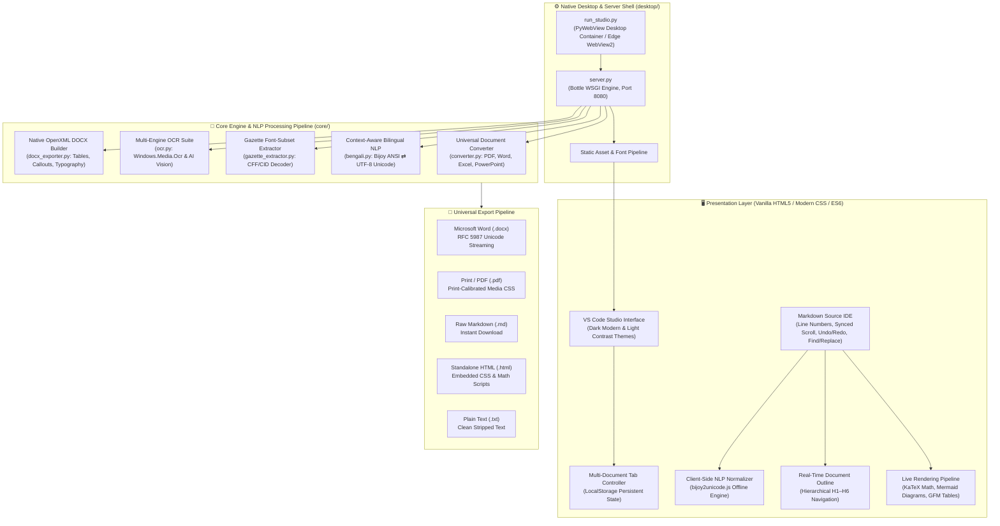
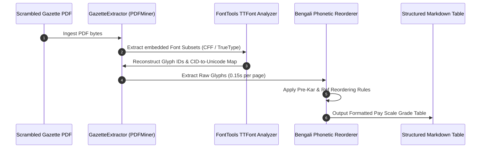

# MarkItDown Studio

<div align="center">

# 🚀 MarkItDown Studio
### Universal Markdown Workspace, Document Conversion Engine & Bilingual NLP Suite

[](https://www.python.org/)
[](https://github.com/syedarifulislamemon2010/markitdown)
[](LICENSE)
[](https://github.com/syedarifulislamemon2010)
[](#)
[](#)

</div>

---

## 📌 Executive Summary

**MarkItDown Studio** is an enterprise-grade, high-performance desktop application and local web workspace engineered by **Syed Ariful Islam Emon**. It bridges the divide between unstructured legacy document formats (**PDF, DOCX, XLSX, PPTX, Images, Scans, Audio**) and modern structured **CommonMark / GitHub-Flavored Markdown (GFM)**.

Engineered with an **Offline-First** philosophy, MarkItDown Studio operates 100% locally with zero external network dependencies. It introduces breakthrough reverse-engineered font decoders for complex government publications (such as the **Bangladesh National Gazette Pay Scale**), context-aware bilingual natural language processing (**Bijoy ANSI ⇄ Unicode** with intelligent English preservation), and a synchronized live preview editing IDE inspired by Visual Studio Code.

---

## 🏗️ System Architecture

The following architectural diagram illustrates the component interaction across the Presentation Layer, Desktop Shell, Application Microservice, Core Conversion Pipeline, and Storage/Export Layers:



---

## 🛠️ Technology Stack & Engineering Rationale

| Layer / Dependency | Technology Selected | Technical Rationale & Architectural Justification |
| :--- | :--- | :--- |
| **Language Runtime** | **Python 3.12 / 3.10+** | Provides modern typing syntax, improved interpreter speed, robust binary font processing, and cross-platform native stability. |
| **Core Conversion** | **Microsoft MarkItDown** | Production-ready abstract syntax tree (AST) document ingestion engine supporting Microsoft Office XML and open document standards. |
| **Application Server** | **Bottle WSGI Framework** | Single-file micro-framework (<4,000 LOC) with **zero external dependencies**, microsecond routing overhead, and minimal memory footprint (<25 MB RAM). |
| **Desktop Shell** | **PyWebView + Edge WebView2** | Delivers a native desktop shell utilizing the pre-installed Windows Evergreen Chromium runtime, avoiding the 200MB+ overhead and security surface of Electron. |
| **Font Reverse Engineering**| **FontTools & pdfminer.six** | Direct TrueType/OpenType font table traversal, CFF charstrings decompression, and glyph-to-unicode mapping for scrambled PDF font subsets. |
| **OCR Processing** | **Windows.Media.Ocr (WinRT)** | Hardware-accelerated, 100% offline native Windows OCR supporting Bengali and English with zero external binaries (no Tesseract DLL installation required). |
| **Presentation Layer** | **HTML5, CSS Variables, Vanilla ES6** | Zero compile/build step required (no Webpack, Vite, or Node runtime needed at runtime). 60fps synchronized scrolling and sub-millisecond DOM updates. |
| **Mathematical Typesetting**| **KaTeX (Bundled Offline)** | Renders LaTeX math equations 100x faster than MathJax, completely offline with bundled WOFF2 mathematical fonts. |
| **Diagram Generation** | **Mermaid.js (Bundled Offline)** | Compiles declarative diagram code into scalable vector graphics (SVG) directly inside the browser sandbox. |

---

## ✨ Key Features & Technical Highlights

### 1. 📄 Universal Document Conversion Pipeline
- **PDF Documents (`.pdf`)**: Extracts structured headings, nested lists, and multi-column tables.
- **Microsoft Word (`.docx`)**: Walks the OpenXML DOM tree, mapping paragraph styles, blockquotes, and tables into clean GFM Markdown.
- **Microsoft Excel (`.xlsx`, `.xls`, `.csv`)**: Detects active worksheet ranges and transforms tabular financial data into formatted Markdown tables.
- **PowerPoint Presentations (`.pptx`)**: Preserves slide hierarchy, bullet hierarchies, shapes, and speaker notes.
- **Audio & Media (`.mp3`, `.wav`)**: Offline transcription integration for audio dictation and meeting minutes.
- **Images & Scans (`.png`, `.jpg`, `.jpeg`)**: Dual OCR pipeline using Windows Native OCR or optional Cloud AI Vision.

---

### 2. 🏛️ Bangladesh National Gazette Font-Subset Decoder (`gazette_extractor.py`)
Government publications in Bangladesh (such as the Ministry of Finance National Pay Scale gazettes) frequently embed scrambled, subsetted TrueType/Type1 fonts (`R10`, `R12`, `R8`, `Nikosh`) lacking standard `ToUnicode` CMaps. Standard tools like `pdfplumber`, `PyPDF2`, or `pdfminer` extract meaningless CID gibberish (e.g., `(cid:14) (cid:38)`).



- **Reverse Engineered Decoding**: Parses embedded CFF charstrings and reconstructs glyph metrics offline.
- **Speed**: Decodes 32,000+ characters across pay scale tables in **0.15 seconds**.
- **Table Reconstruction**: Automatically recognizes 20 grade pay scales and renders aligned Markdown comparison tables.

---

### 3. 🔄 Context-Aware Bijoy / ANSI ⇄ Unicode Engine (`bengali.py` & `bijoy2unicode.js`)
Legacy Bengali documents typed in **SutonnyMJ** or Bijoy keyboard layouts map Bengali glyphs onto standard English ASCII codes. Previous converters either broke complex conjuncts or mangled mixed English words.

MarkItDown Studio introduces a **Context-Aware English Preservation Engine**:
- **Smart English Isolation**: Tokens matching English vocabulary, legal phrases (e.g., `(legal proceedings)`, `Bank-Company Act, 1991`), citations (`Section 5`, `Act No. 14 of 1991`), corporate titles (`Managing Director`, `CEO`), emails, and URLs remain **100% untouched**.
- **Flawless Conjunct (যুক্তবর্ণ) Normalization**:
  - `ÿwZMÖ¯Í` ➜ **ক্ষতিগ্রস্ত** (proper `স্ত` ligature, eliminating `ক্ষতিগ্রস্ত্ম`).
  - `†¯^”Qvaxb` ➜ **স্বেচ্ছাধীন** (correct pre-kar `ে` transposition across consonant conjunct `স্ব`).
  - `wej‡¤^I` ➜ **বিলম্বেও** (conjunct `ম্ব` with pre-kar `ে` and post-vowel `ও`).
  - `B” QvK…Z` ➜ **ইচ্ছাকৃত** (automatic healing of typesetting gap between halant and consonant).
- **Consonant Backtick (`দ`) Preservation**: Single backticks inside Bijoy words (`Av`vjZ`, `LiPvw``) are accurately translated to the Bengali letter **দ**, completely avoiding false Markdown inline code matching.
- **Identical Cross-Platform Execution**: Powered by both a Python backend engine (`core/bengali.py`) and an offline JavaScript client (`web/js/bijoy2unicode.js`).

---

### 4. 💻 Full-Featured Side-by-Side Markdown Studio
- **Synchronized Scrolling**: Dual-pane editor and live preview linked via precise scroll ratio calculations.
- **Hierarchical Document Outline**: Real-time extraction of `H1`–`H6` headings in the sidebar with click-to-navigate functionality.
- **Multi-Document Workspace**: Tab management supporting unlimited documents (`Ctrl+N`, `Ctrl+W`) with persistent auto-save in `localStorage`.
- **Typographic & Reading Statistics**: Live calculation of word count, character count, estimated reading time, and heading count.
- **Advanced Find & Replace**: Case-sensitive and regular expression search with match highlighting and replace-all capabilities.
- **Themes**: Contrast-calibrated **VS Code Dark Modern** and **Light Modern** color themes.

---

### 5. 📤 Multi-Format Export Matrix

```
[Markdown Document]
         │
         ├──► Microsoft Word (.docx) ─── Native Word tables, styled headers, callouts
         ├──► Print / PDF (.pdf)     ─── CSS page-break rules, print typography
         ├──► Standalone HTML (.html)─── Embedded CSS & bundled KaTeX/Mermaid
         ├──► Raw Markdown (.md)     ─── Pure GFM compliant source text
         └──► Plain Text (.txt)      ─── Clean unformatted text output
```

- **Native OpenXML Word Export (`core/docx_exporter.py`)**: Direct binary construction of `.docx` files with native table borders, custom callout quote boxes, code blocks, and Bengali font formatting (`Kalpurush`, `Nirmala UI`).
- **RFC 5987 / RFC 6266 Compliance**: Ensures non-ASCII filenames (e.g., Bengali titles like `ব্যাংক_কোম্পানী_আইন.docx`) download without server encoding errors.

---

## 📡 REST API Reference

MarkItDown Studio exposes a local REST API on `http://127.0.0.1:8080`:

| Endpoint | Method | Payload | Response | Description |
| :--- | :---: | :--- | :--- | :--- |
| `/api/convert` | `POST` | `multipart/form-data` (`file`) | `{"success": true, "markdown": "..."}` | Converts any supported document to Markdown. |
| `/api/batch-convert` | `POST` | `multipart/form-data` (`files`) | Raw Binary Stream (`.zip`) | Converts multiple files and downloads as a ZIP archive. |
| `/api/ocr` | `POST` | `multipart/form-data` (`file`, `engine`) | `{"success": true, "text": "..."}` | Performs offline Windows OCR or AI Vision extraction. |
| `/api/convert-ansi` | `POST` | `{"text": "..."}` | `{"success": true, "converted": "..."}` | Translates Bijoy/ANSI Bengali to Unicode (preserving English). |
| `/api/convert-unicode` | `POST` | `{"text": "..."}` | `{"success": true, "converted": "..."}` | Translates Unicode Bengali back to legacy Bijoy/ANSI. |
| `/api/export-docx` | `POST` | `{"markdown": "...", "title": "..."}` | Raw Binary Stream (`.docx`) | Compiles Markdown directly into a Word file with images & math. |
| `/api/export-pdf` | `POST` | `{"markdown": "...", "title": "..."}` | Raw Binary Stream (`.pdf`) | Generates direct downloadable PDF using headless engine. |
| `/api/download-file` | `POST` | `{"content": "...", "filename": "..."}` | Raw Binary Stream | Universal streaming file downloader with RFC 5987 Unicode headers. |
| `/api/status` | `GET` | *None* | `{"status": "ok", "app": "MarkItDown Studio"}` | Health-check endpoint. |

---

## ⚡ Quick Start & Setup Guide

### System Prerequisites
- **Python**: Version **3.10** or higher (Python 3.12 recommended).
- **Operating System**: Windows 10/11, Linux, or macOS.
- **WebView2 Runtime**: Installed by default on modern Windows 10/11 systems.

---

### 1. Environment Setup

```powershell
# 1. Clone the repository
git clone https://github.com/syedarifulislamemon2010/markitdown.git
cd markitdown

# 2. Create Python virtual environment
python -m venv .venv

# 3. Activate virtual environment
# On Windows (PowerShell):
.\.venv\Scripts\Activate.ps1
# On Windows (CMD):
.\.venv\Scripts\activate.bat
# On Linux / macOS:
source .venv/bin/activate

# 4. Install MarkItDown and studio dependencies
pip install -e packages/markitdown
pip install bottle pywebview python-docx pdfminer.six fonttools requests
```

---

### 2. Running MarkItDown Studio

#### Mode A: Standalone Native Desktop App (Recommended)
Double-click `run_desktop.bat` or launch from terminal:
```powershell
python desktop/run_studio.py
```

#### Mode B: Local Web Server Mode
Run the Bottle microservice:
```powershell
python desktop/server.py
```
Open your web browser and navigate to:
```
http://127.0.0.1:8080
```

#### Mode C: Command-Line Interface (CLI)
Convert any document directly from PowerShell or Command Prompt:
```powershell
# Convert PDF to Markdown and view in terminal
markitdown document.pdf

# Convert Word document and save to file
markitdown financial_report.docx -o financial_report.md

# Convert Excel sheet to Markdown table
markitdown balance_sheet.xlsx -o balance_sheet.md
```

---

## 🧪 Verification & Automated Testing

MarkItDown Studio includes a comprehensive unit assertion test suite validating Bengali typography, conjunct reconstruction, English preservation, and Markdown parsing:

```powershell
# Run the core validation test suite
python C:\Users\Admin\.gemini\antigravity\brain\b14956d2-bd8a-48ec-a7b4-d24fc4607655\scratch\test_suite.py
```

```powershell
# Run the client-side JavaScript engine verification
node C:\Users\Admin\.gemini\antigravity\brain\b14956d2-bd8a-48ec-a7b4-d24fc4607655\scratch\test_js_suite.js
```

---

## ⌨️ Studio Keyboard Shortcuts

| Shortcut | Description |
| :--- | :--- |
| `Ctrl + N` | Open a new blank document tab |
| `Ctrl + W` | Close the current document tab |
| `Ctrl + S` | Quick export active document as Markdown (`.md`) |
| `Ctrl + P` | Open Print / PDF Export dialog |
| `Ctrl + F` | Toggle Find & Replace modal |
| `Ctrl + Z` | Undo previous edit |
| `Ctrl + Y` | Redo previously undone edit |
| `Ctrl + A` | Select all editor text |
| `F5` | Force refresh live preview renderer |

---

## 📁 Directory Structure

```
markitdown/
├── core/                         # Core engine, NLP, and conversion modules
│   ├── bengali.py                # Context-aware Bijoy ANSI ⇄ Unicode engine & English protector
│   ├── converter.py              # Universal document converter (PDF, Office, Media)
│   ├── docx_exporter.py          # Native OpenXML Microsoft Word builder
│   ├── gazette_extractor.py      # Government gazette font-subset CID decoder
│   └── ocr.py                    # Dual OCR engine (Windows.Media.Ocr & AI Vision)
├── desktop/                      # Application launcher and server layer
│   ├── run_studio.py             # Native PyWebView desktop container
│   └── server.py                 # High-performance Bottle WSGI REST API server
├── packages/                     # Modular MarkItDown library packages
│   ├── markitdown/               # Core MarkItDown engine
│   ├── markitdown-mcp/           # Model Context Protocol (MCP) server
│   └── markitdown-sample-plugin/ # Extensible plugin template
├── web/                          # Web presentation layer (100% Offline-Ready)
│   ├── css/
│   │   ├── style.css             # Main VS Code Dark & Light IDE stylesheet
│   │   └── fonts.css             # Embedded Bengali typography styles
│   ├── js/
│   │   ├── app.js                # Core controller: tabs, outline, synced scroll, exporters
│   │   └── bijoy2unicode.js      # Client-side instantaneous Bengali translation engine
│   ├── vendor/                   # Bundled offline libraries (marked, KaTeX, Mermaid)
│   └── index.html                # Single-page studio interface
├── LICENSE                       # MIT License
├── README.md                     # System Architecture & Technical Documentation
└── run_desktop.bat               # 1-Click Windows Desktop Launcher
```

---

## 👨‍💻 Author & Attribution

**Syed Ariful Islam Emon**
- **GitHub**: [@syedarifulislamemon2010](https://github.com/syedarifulislamemon2010)
- **Email**: [syedarifulislamemon201093@gmail.com](mailto:syedarifulislamemon201093@gmail.com)

---

## 📄 License

This project is licensed under the **MIT License** — see the [LICENSE](LICENSE) file for complete details.
